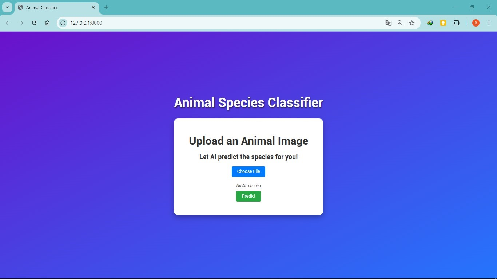
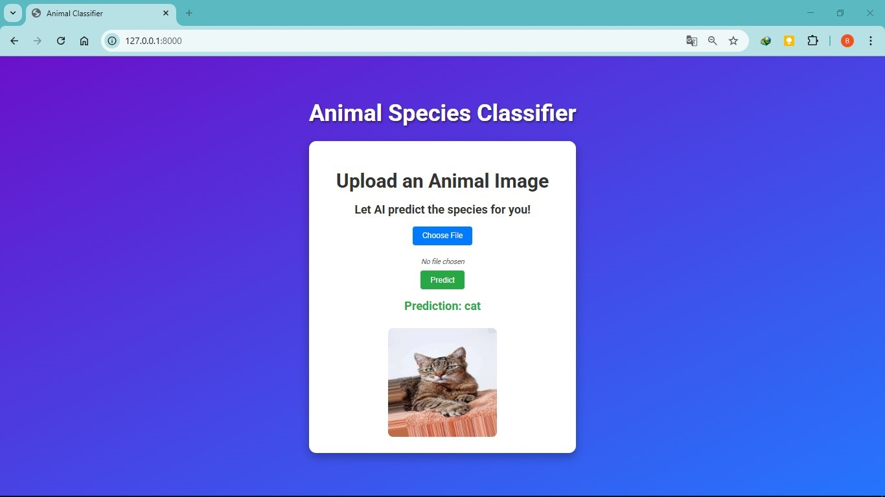
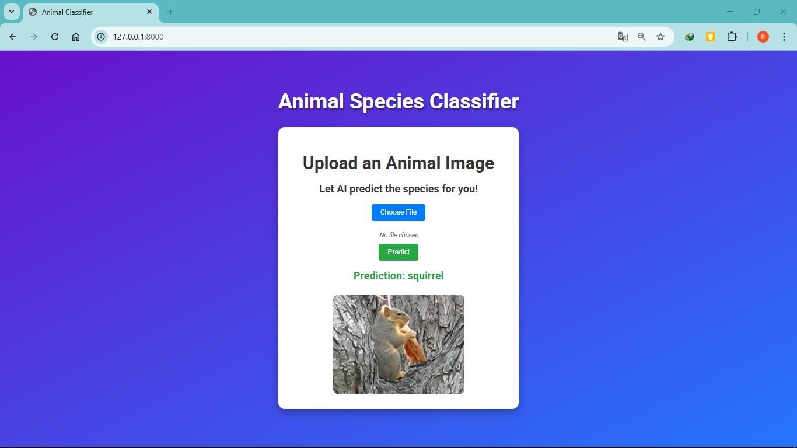
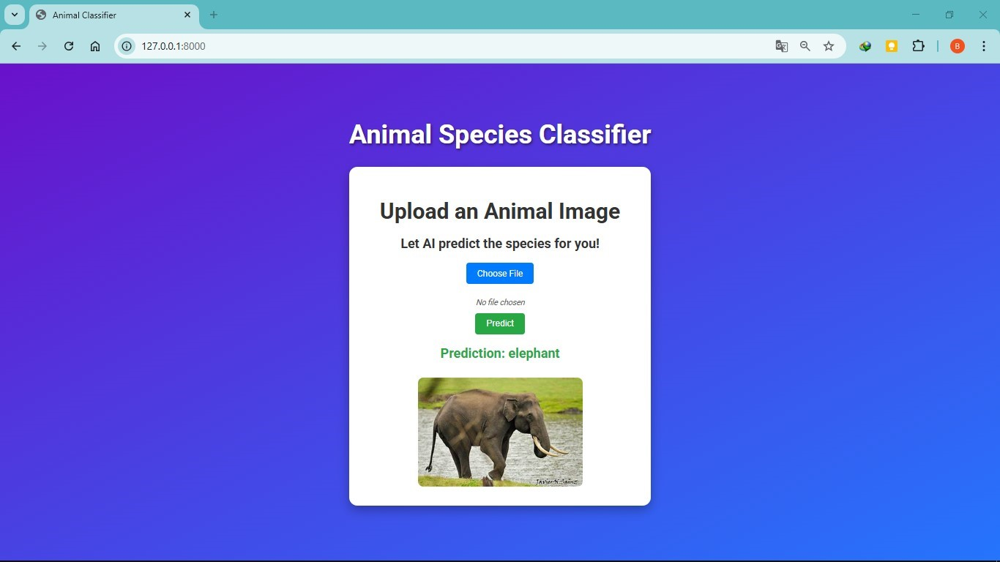
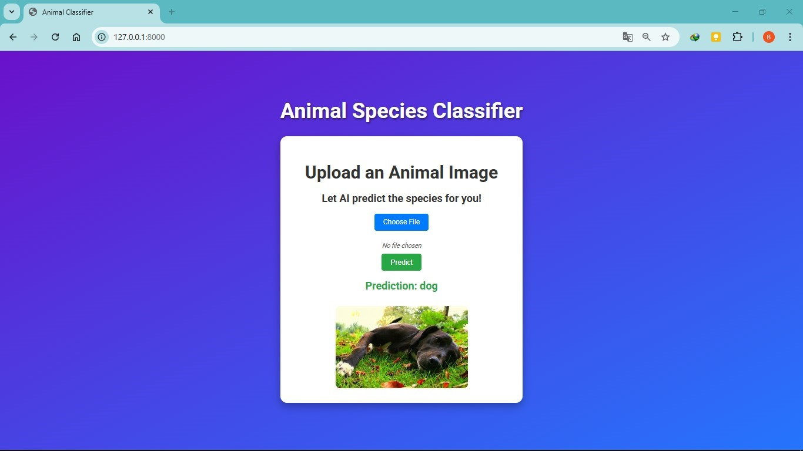

# Animal Species Prediction System

A Django web application that predicts animal species from uploaded images using a fine-tuned VGG-16 model trained on the Animals-10 dataset.

## Overview

This project implements an animal species prediction system capable of identifying 10 different animal classes. The system uses transfer learning with a VGG-16 convolutional neural network architecture.

## Features

- Simple and clean web interface built with Django
- Image upload and classification functionality
- Real-time prediction results with confidence scores
- Visual results for various species like cats, squirrels, elephants, etc.
- Integration of pre-trained deep learning models

## Implementation Details

- Model architecture: VGG-16 with custom classification layers
- Dataset used: [Animals-10 dataset](https://www.kaggle.com/datasets/alessiocorrado99/animals10)
- Model input size: 224x224 pixels
- Prediction output: Animal class label and confidence score
- Backend: Django (Python 3.12)
- Media storage: Local `media/` folder for uploaded images

## Experimentation Process

### Model Training
- Started with base VGG-16 pre-trained on ImageNet
- Replaced the top layers with:
  - Flatten
  - Dense(256, relu)
  - Output Dense(10, softmax)
- Used ImageDataGenerator for augmentation and preprocessing
- Saved trained model as `animal_classifier.h5`
- This file being 96mb was unable to be pushed to this git repository
- Trained a new model with lesser material carrying the same name 

### Web Integration
- Developed using Django framework
- Created custom app `predictor` with views, templates, and static/media support
- Uploaded image is saved and passed to the model for prediction
- Results are displayed directly on the web page

### Template and Static Configuration
- Templates located in: `predictor/templates/predictor/index.html`
- Uploaded images served from `media/` folder
- App registered in `INSTALLED_APPS` in `settings.py`

## Results

Below are sample screenshots of the application in action:

**Idle state (no image uploaded)**  


**Prediction of a blurred cat image**  


**Prediction of a squirrel image**  


**Prediction of an elephant image**  


**Prediction of a dog image**  


## Lessons Learned

- Transfer learning with VGG-16 greatly simplifies training
- Proper handling of file uploads in Django is crucial
- Registering custom apps and templates is mandatory for correct rendering
- Windows path handling requires careful backslash/forward slash consideration

## Future Enhancements

- Improve model accuracy using data augmentation
- Add support for more animal classes
- Deploy application on cloud (e.g., Heroku or PythonAnywhere)
- Add drag-and-drop file upload interface
- Provide detailed prediction breakdown and top-3 results

## Getting Started

1. Clone the repository and navigate to the project folder.

2. Create a virtual environment and activate it:

```bash
python -m venv proj-env
proj-env\Scripts\activate
```

3. Install the dependencies:

```bash
pip install -r requirements.txt
```

4. Ensure your trained model `animal_classifier.h5` is in the root project directory.

5. Run the server:

```bash
python manage.py runserver
```

6. Open your browser and go to [http://127.0.0.1:8000/](http://127.0.0.1:8000/)
